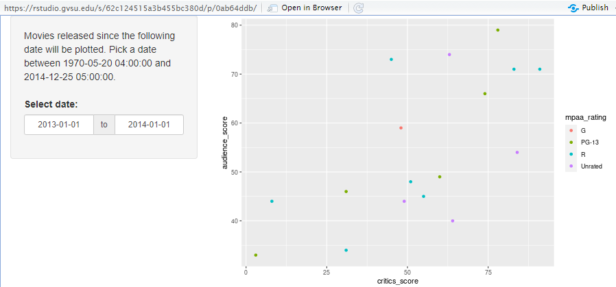

## Growth as a Data Person
- I feel that my growth as a data person as tremondously improved since starting this course. There have been many things that I thought would not have been possible but after finishing this course I realize that the possibilities are endless. 
  1. **Focusing on statistical computing, graphic ideas and methods we have employed learning them.** 
    - Firstly with statistical computing, we just learned how to build [functions](https://github.com/JADunivan5/activity09-functions-intro/blob/main/activity09-functions-intro.md) that make life easier when we have to repeat portions of code over and over. This was something I found to be very useful as it came up in later activityies as well. 
    - Next moving towards graphic methods, throughout my project this semester I have been exploring [NFL](https://github.com/JADunivan5/STA418_Project/blob/main/NFL_Project.Rmd) data. Throughout this process it has been imperative to have graphical displays to understand the data. For example, lightly explaining this process, I have been working to chart play types by occurences on the down they happen. Using the ggplot method I have been able to accomplish this so far, I would still like to explore other graphic models other than what I currently have. 
    - For the final part about the methods we employed in learning them I would like to point towards the activities we work on during class, so a activity I found to be extremely heplful in my growth as a data person was our [Denny's](https://github.com/JADunivan5/activity07-joins/blob/main/activity07-joins.Rmd) activity, more specifically the mutate portion as I had to do something similar in my NFL project. Expanding on that it'll be shown later in the code where I used the mutate function for a mathmatical equation.
- Now, how do these items show growth?
  - I chose these items because I felt that they best exmplify the growth that I have had throughout this class. After doing the activities such as last weeks with the functions or the [Denny's activity](https://github.com/JADunivan5/activity07-joins/blob/main/activity07-joins.Rmd) (more specifically line 121 "filter" command), I found that there are things in there I could use to develop my project and take it a step further. Finally I feel that best exmplifies my growth with the graphical methods because from I first started working on the graphical displays it was nightmare to read. Now, after working through issues with my professor I feel more confident in being able to recreate more graphical displays in the project. Taking the graphical display portion a step further by using shiny apps you can now make them ineractive. Below I will provide a screenshot of what we did in activity 13 with the hopes of implementing it into my NFL project eventually.
  -   
As you can see this is now interactive, a user within the shiny app would be able to edit the dates on the left to change the graph. This shows the growth of going from non interactive graphs with data to now being able to use shiny apps and making interactive plots for the user to input desired dates when it comes to data. 
