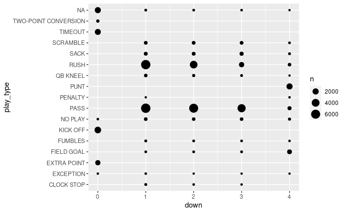
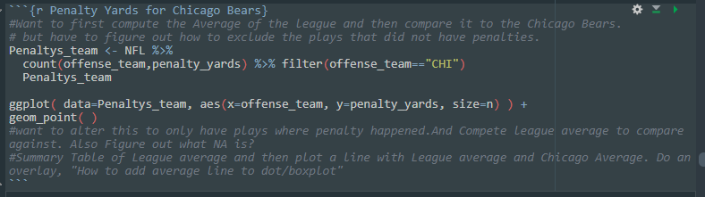
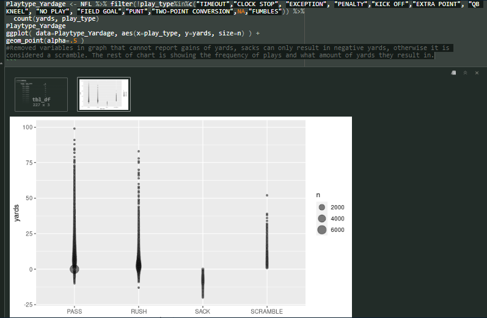

#Final Grade Reflection
## 1. What Grade Did You Earn?
- Currently I would say I have met the grade requirements for a "B", with hopes of pushing that towards and "A". (This in my opinion has remained unchanged)
## 2. How Did You Demonstrate That Grade?
- That grade I believe is currently demonstrated by the completion of 4 of the 5 course objectives, with 1 hoping to be accomplished later on in the class.
  - Starting with the first one that have been satisfied. We can look towards the [NFL Project](https://github.com/JADunivan5/STA418_Project/blob/main/NFL_Project.md#reading-in-data) I am working on. This satisfied the objective of **"Import, manage and clean data"**. This is completed in my project the dataset was succesfull imported, managed and cleaned. As well as taken step further by using the janitor package to give variable names cleaner names for better ease of use. 
  - 
  - 
  - 
  - Next this also satisfies the **"Create graphical displays and numerical summaries of data for exploratory analysis and presentations."**. One of the first things I attempeted to do was charting the play types by the down they happened on. This is still being refined further but I would say that it does satisfy the requirement. Here is example image of what has been done so far! .
  - Now for the 2 that I feel have been accomplished since the midterm. The first objectiveve that I feel is no longer a work in progress would have to be the **"Use source documentation and other resources to troubleshoot and extend R programs."**. The reason I feel this has now been satisfied is because, yes I have used documenation such as the janitor package page to troubleshoot, but now I feel that unless it is an extremely technical question I am confident in my ability to use for example "?function" and be able to apply it to my current situation without little issues. A supporting artifact for this would be [Activity 11](https://github.com/JADunivan5/activity11-simulation/blob/main/activity11-simulation.Rmd) more specifically from line 130 to 144 the reasion I chose this is because Activity 09 was the intro to functions and this now Activity 11 showing the refined skill and application. Shows the process of creating the fucntion and then applying it. Based on this I feel this shows the trouble shooting gprocess to get to the point I am at currently. Next objective that is bi kibger a  work in progress currently would be **"Write clear, efficient, and well-documented R programs."** To some extenet I feel that yes, have written R-programs but its the clear, efficient and well documented part I feel that is not all there. I have been adding comments within my NFL project code with the goal of outling what I want to do in certain sections of code, but it has not alwasy been the most effeicnt in those code chunks with certain code being scattered in different sections. This makes it a little muddy to understand when viewing, my hope is to have everthing clearned up when the project is complete so that everything is in a logical order and makes sense when viewing. here is an example image of the what I am talking about 
  - .  
I would like to update this last section based on work that has been done in my NFL project.
.  
Here we can see a section that has been commented and detailing what has been done and what exactly the code has been doing. This I feel satisfies the objective, unlike the miterm one that had comments all over. I left that one in here to be used as a comparison. Further more the code is efficent and concise I feel I took the most direct path possible for removing variables within that section.
  - Finally for the last objective that I feel has not been addressed yet but hope to address later on in the course! It would be **"Write R programs for simulations from probability models and randomization-based experiments."**. This is something I hope to incoperate into my NFL Project, my idea would be to take a selection of variables and model them to predict a teams expected win-percentage. Or another idea I had thought to do which maybe would be outside the scope of this course would be to input a teams record and then have the code return a probability that they achieve this record based upon the variables there were selected. Possibly this could be done like Activity 13 "Shiny apps" where the user could input the team and the desired record and then have the graph show the probability of this

## 3. What Else?
- 
